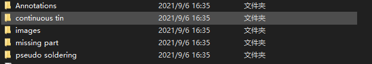

# sorted
 Can be used for cutting objects from image based on Pascal VOC

代码仅支持解析Pascal VOC数据集类型的标注文档
已实现：
1.根据xml.dom.minidom解析Pascal VOC标注文档获取目标位置与类别，后通过opencv进行切割图片并进行分配类号、序号保存
2.目标文件保存格式：文件名_种类_该种类下第n个.jpg
使用指南；
1.打开sorted.py代码文件，对应自己已标注好的文档对下列参数进行修改，并在根目录下新建好对应的文件夹：

    type_list = ['continuous tin', 'pseudo soldering', 'missing part']
    #声明标注文档文件夹地址、代切割图片文件夹地址与目标种类文件夹地址
    Annotation_dir = './Annotations/'
    img_dir = './images/'
    sorted_path = ['./continuous tin/','./pseudo soldering/','./missing part/']
    type_count =[0,0,0]#已知种类个数，若增加或减少类则相应增加或减少列表长度
2.打开cmd/开发工具，运用sorted.py，如CMD在当前文件夹环境下执行python sorted.py
待实现：
1.类对象
2.Yolo、CoCo类型标注文档